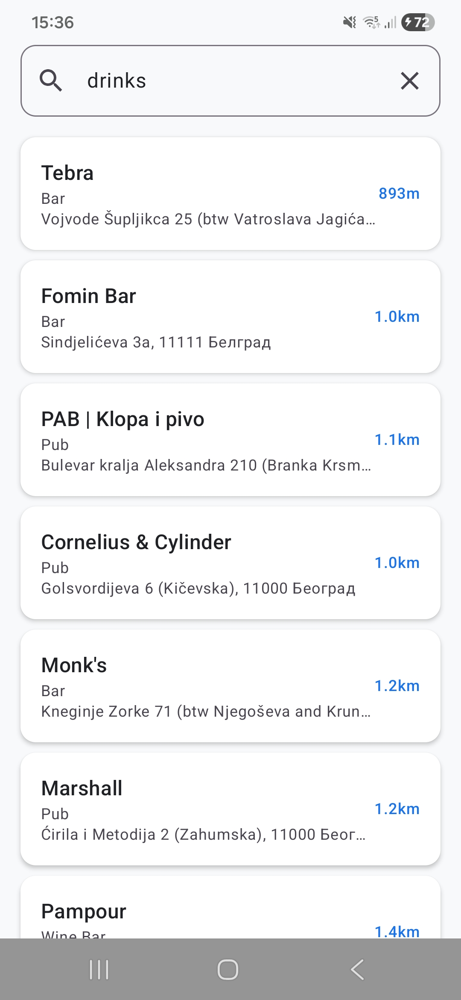
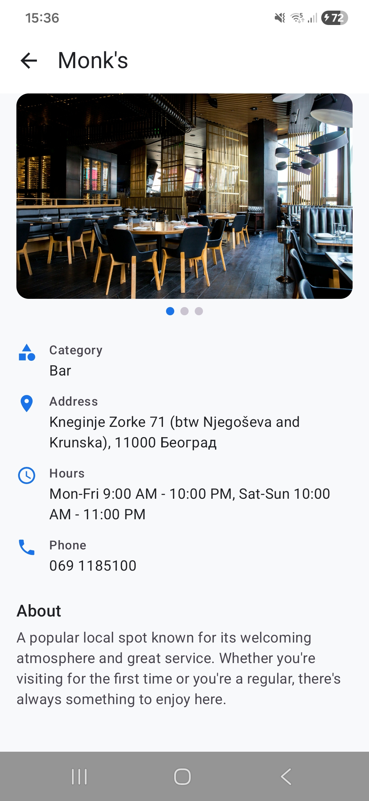
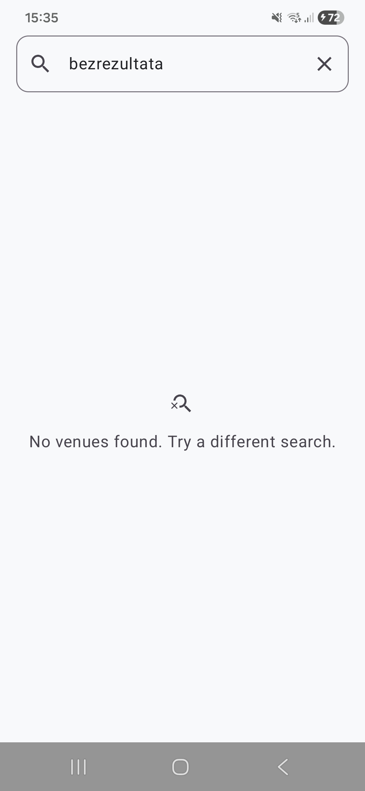
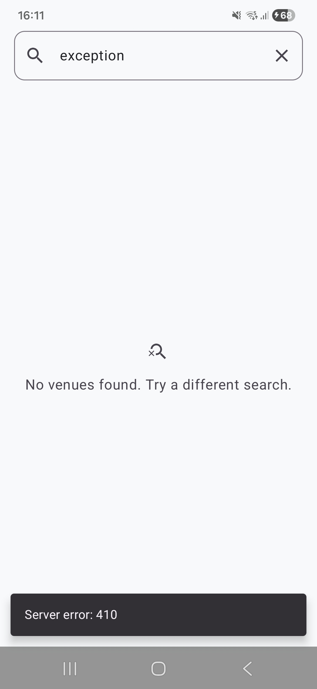
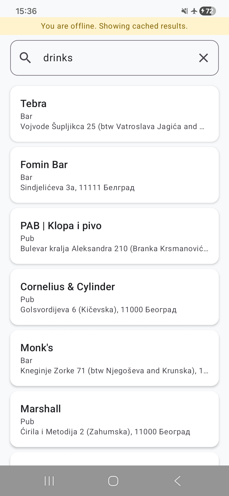
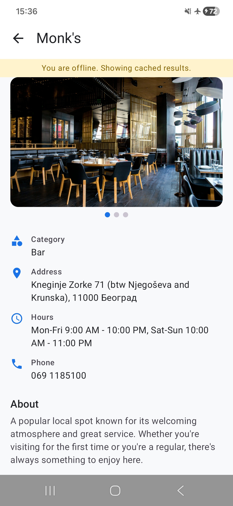

# Venue Finder

Android application that uses the Foursquare Places API to search for venues near the user's location and display detailed venue information, with full offline support.

## Screenshots

### Online
| Search Results | Venue Details | Empty Results | API Error |
|:-:|:-:|:-:|:-:|
|  |  |  |  |

### Offline Mode
| Cached Search | Cached Details |
|:-:|:-:|
|  |  |

## Architecture

The project follows **Clean Architecture** with **MVVM** pattern, organized by feature:

```
User Action
  -> ViewModel (collects Flow from UseCase)
    -> UseCase (delegates to Repository)
      -> Repository:
          1. Fetches from API -> writes to Room
          2. Observes Room Flow -> emits to UI
          (on network error, cached data is served if available)
          (on API error, error is propagated without cached fallback)
    -> ViewModel (maps Resource to UiState)
  -> Compose UI (recomposes on state change)
```

Each feature (search, details) has three layers:
- **Presentation** - ViewModel + Compose UI
- **Domain** - Use cases, repository interfaces, domain models
- **Data** - Repository implementations, data sources, mappers, DTOs

## Tech Stack

| Component | Technology |
|-----------|-----------|
| UI | Jetpack Compose + Material 3 |
| Architecture | MVVM + Clean Architecture |
| DI | Hilt |
| Networking | Retrofit 3 + OkHttp 5 + kotlinx.serialization |
| Local DB | Room |
| Image Loading | Coil |
| Navigation | Navigation Compose (type-safe) |
| Location | Google Play Services (FusedLocationProvider) |
| Async | Kotlin Coroutines + Flow |
| Testing | JUnit + MockK + Turbine + Coroutines Test |

## Project Structure

```
app/src/main/java/com/vladan/holycodetask/
├── core/
│   ├── common/          # Resource wrapper, AppError, location utils
│   ├── database/        # Room DB, DAOs, entities
│   ├── designsystem/    # Theme, shared composables (OfflineBanner, LoadingScreen)
│   ├── navigation/      # Routes, NavHost
│   └── network/         # Retrofit API, DTOs, AuthInterceptor, NetworkMonitor
├── di/                  # Hilt modules (Network, Database, App)
└── feature/
    ├── search/
    │   ├── data/        # Remote/local data sources, mapper, repository impl
    │   ├── domain/      # Venue model, repository interface, use cases
    │   └── presentation/# SearchViewModel, SearchScreen, VenueCard
    └── details/
        ├── data/        # Remote/local data sources, mapper, repository impl
        ├── domain/      # VenueDetails model, repository interface, use case
        └── presentation/# DetailsViewModel, DetailsScreen, PhotoCarousel
```

## Setup

1. Clone the repository
2. Add your Foursquare API key to `gradle.properties`:
   ```properties
   FSQ_API_KEY=your_api_key_here
   ```
3. Open in Android Studio and sync Gradle
4. Run on a device/emulator with Google Play Services (required for location)

**Requirements:** Android Studio Ladybug+, JDK 11+, Min SDK 28 (Android 9)

## Key Design Decisions

### Offline-First (Single Source of Truth)

The UI always reads from Room via reactive Flows. API calls only write to Room. There is no `if (hasNetwork)` branching in the repository layer — the repository always attempts the API call and catches the exception if it fails. This ensures:
- Cached data is always available instantly
- No race conditions between network and cache reads
- `NetworkMonitor` is used only in the UI layer for the offline banner

### Parallel Data Loading with channelFlow (Details)

`DetailsRepositoryImpl` uses `channelFlow` to observe Room and fetch from API concurrently. When navigating from search to details, the venue is already cached (from the search). The Room observer emits cached data immediately while the API fetches full details in the background. This provides instant content display without waiting for the network.

### Typed Error Handling

Errors flow through a typed pipeline:
- `Throwable` -> `AppError` (sealed interface: `NetworkError`, `HttpError`, `Unknown`)
- `AppError` -> `UiEvent?` (via `toUiEvent()`)
- `NetworkError` produces `null` — the offline banner is sufficient, no redundant snackbar
- Other errors produce `ShowSnackbar` events sent through a `Channel` for one-time consumption

### Coroutine Safety

`runSuspendCatching` is used instead of `runCatching` to properly propagate `CancellationException`, preserving structured concurrency guarantees.

## Testing

The project includes unit tests covering repositories and use cases:

```
./gradlew testDebugUnitTest
```

Tests use MockK for mocking, Turbine for Flow testing, and kotlinx-coroutines-test for coroutine control. Coverage includes success paths, network failures, cache fallbacks, and data mapping.

### Test Coverage (JaCoCo)

The project has JaCoCo configured for coverage reporting. To generate an HTML coverage report:

```
./gradlew jacocoTestReport
```

The report will be available at `app/build/reports/jacoco/jacocoTestReport/html/index.html`.

Coverage excludes generated code (Hilt, Room, Compose, BuildConfig), the `core` package, and UI-only classes (screens, components, UI state models). This focuses the coverage metric on testable business logic: repositories, use cases, mappers, and ViewModels.
